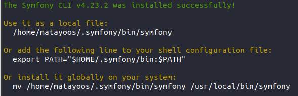

## Wednesday, March 3, 2021, 9:34:21AM -03 <1614774861>



## Wednesday, March 3, 2021, 8:15:48AM -03 <1614770148>

### Free Code Camp

This doesn't work for me:

```php
    public function index(): Response
    {
        return new Response(content: '<h1>Welcome, Matayoos!</h1>');
    }
```

But this does:

```php
    public function index(): Response
    {
        $response = new Response(
            '<h1>Welcome, Matayoos!</h1>',
            Response::HTTP_OK,
            ['content-type' => 'text/html']
        );
        return $response;
    }
```
