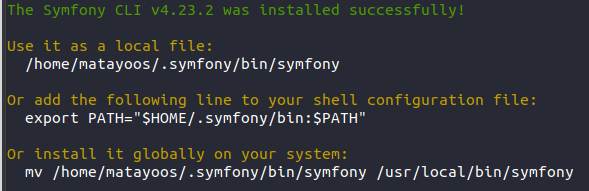

## Tuesday, April 6, 2021, 10:06:33AM -03 <1617714393>

- Show all the *alias* defined in the environment

```bash
$ alias
```

- We can also use the *type* command to see our alias

```bash
$ type foo
foo is aliased to `cd /usr; ls; cd -'
```

- To remove an alias, the *unalias* command is used

```bash
[me@linuxbox ~]$ unalias foo
[me@linuxbox ~]$ type foo
bash: type: foo: not found
```

## Wednesday, March 3, 2021, 9:43:21AM -03 <1614775401>

- 'eog' is the command to open pictures by terminal.

### How to make scripts files executable

- Step one:
  - Make your script file as you like.
- Step two:
  - Choose one:
    
    
